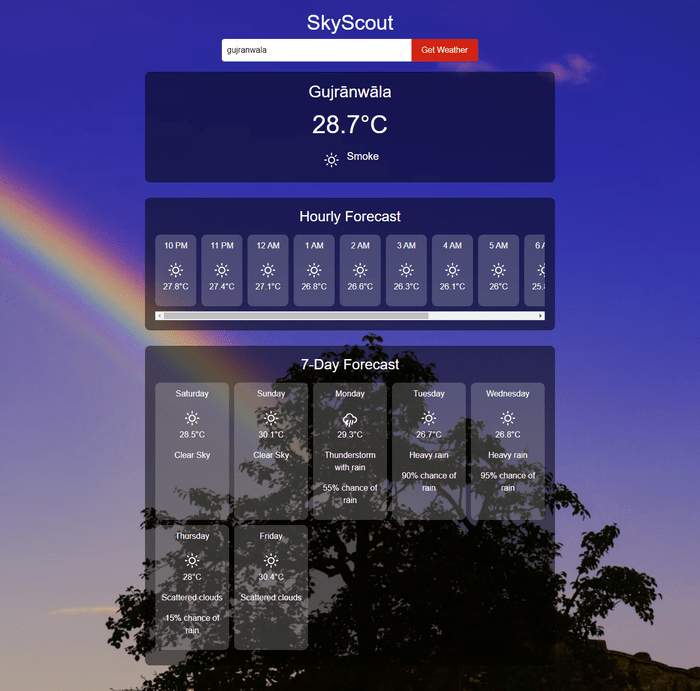

# SkyScout: Your Ultimate Weather Guide

🌤️ Welcome to **SkyScout**, a React-based web application designed to provide you with accurate and detailed weather information. With features like hourly and weekly forecasts, weather icons, precipitation chances, and a dynamic background, SkyScout ensures you stay prepared for whatever the weather brings. This document will guide you through the application's features, installation, and usage.

## Table of Contents

1. [Introduction](#introduction)
2. [Features](#features)
   - [Current Weather](#current-weather)
   - [Hourly Forecast](#hourly-forecast)
   - [Weekly Forecast](#weekly-forecast)
   - [Dynamic Background](#dynamic-background)
   - [Responsive Design](#responsive-design)
3. [User Interface Overview](#user-interface-overview)
   - [Home Page](#home-page)
4. [Installation](#installation)
5. [Usage](#usage)
   - [General Instructions](#general-instructions)
6. [Contributing](#contributing)
7. [License](#license)
8. [Contact](#contact)

## Introduction

**SkyScout** is a comprehensive weather application built with React. It provides real-time weather updates, hourly forecasts, and a 7-day outlook, complete with weather icons and precipitation chances. The app’s design is responsive and visually appealing, with a dynamic background that changes according to the weather conditions.

## Features

### Current Weather

Get instant access to the current weather conditions for your city. SkyScout displays the temperature, weather description, and an appropriate weather icon.

### Hourly Forecast

Plan your day better with a 12-hour forecast. SkyScout provides temperature predictions, weather icons, and precipitation chances for each hour, ensuring you are never caught off guard by sudden weather changes.

### Weekly Forecast

Stay ahead of the weather with a 7-day forecast. Each day’s weather is summarized with temperature, conditions, and chances of precipitation.

### Dynamic Background

SkyScout features a dynamic background that adapts to the current weather, offering an immersive experience that reflects real-time conditions.

### Responsive Design

SkyScout is fully responsive, ensuring a seamless experience across all devices, whether you’re on a desktop, tablet, or mobile phone.

## User Interface Overview

### Home Page

The home page of **SkyScout** is designed for simplicity and functionality:

- **City Input**: Positioned at the center of the page (both horizontally and vertically), the city input field allows users to enter their desired location. The "Get Weather" button is right next to it, providing easy access to weather data with a single click.
  
- **Current Weather Section**: Displays the current temperature, weather icon, and description prominently. This section is designed with a sleek, transparent background that allows the dynamic background image to shine through.

- **Hourly Forecast Section**: Below the current weather, you will find the hourly forecast presented in a scrollable, horizontal layout. Each hour’s forecast includes the time, temperature, weather icon, and chance of precipitation if applicable.

- **Weekly Forecast Section**: The weekly forecast is displayed in a grid format, providing a clear and concise overview of the weather for the next seven days. Each day’s forecast includes the day of the week, temperature, weather icon, and precipitation chances.




## Installation

To install and run SkyScout locally, follow these steps:

1. **Clone the repository:**

   ```bash
   git clone https://github.com/YourUsername/WeatherApp-React.git


2. **Navigate to the project directory:**
   ```bash
   cd TextApp-React
   ```
3. **Install dependencies using npm:**
   ```bash
   npm install
   ```
4. **Start the development server:**
   ```bash
   npm start
   ```
5. **Open your web browser and navigate to:**
   ```bash
   http://localhost:3000
   ```
###   Usage
1. Open SkyScout in your web browser.
2. Enter your city in the input box at the center of the page.
3. Click "Get Weather" to retrieve the current, hourly, and weekly weather forecasts.
- Current Weather: See the temperature, weather icon, and description.
- Hourly Forecast: Scroll horizontally to view the next 12 hours of weather, complete with temperature, icon, and precipitation chances.
- Weekly Forecast: View the 7-day outlook in a grid format with daily temperature, weather icon, and precipitation chances.

## Contributing

We welcome contributions to improve this application. Please follow these steps:

1. Fork the repository or clone it locally:
   ```bash
   git clone https://github.com/Armish11/WeatherApp-React.git
   ```
2. Create a new branch:
   ```bash
   git checkout -b feature-branch
   ```
3. Make your changes and commit them:
   ```bash
   git commit -m "Description of changes"
   ```
4. Push to the branch:
   ```bash
   git push origin feature-branch
   ```
5. Open a pull request on GitHub if you would like to propose your changes.


### License
This project is licensed under the MIT LICENSE. See the [License](./License)file for more details.

## Contact

If you have any questions, feedback, or suggestions, feel free to contact me on [GitHub](https://github.com/Armish11). I'll be happy to assist!


